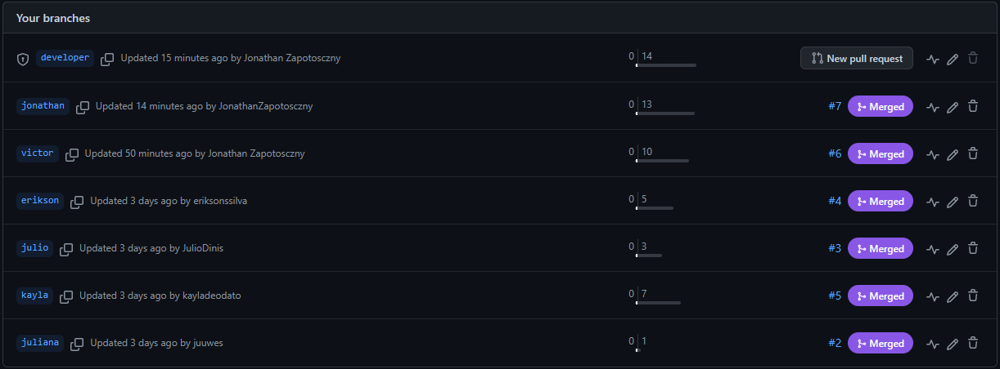

<h1 align=center> MJV SCHOOL JAVA - SEMANA 01 </h1>

<strong>DESAFIO</strong>: Usando um bloco de notas crie uma classe denominada Conta Corrente com os atributos e métodos a seguir:

<h2>ATRIBUTOS</h2>
<ul> 
  <li>Número da conta</li>
  <li>Número da agência</li>
  <li>Nome do cliente</li>
  <li>Data de nascimento</li>
  <li>Saldo da conta</li>
</ul>

<h2>MÉTODOS</h2>
<ul> 
  <li>Sacar um valor</li>
  <li>Transferir um valor para outra conta</li>
  <li>Cancelar a conta com uma justificativa</li>
  <li>Consultar extrato entre duas datas</li>
  <li>Consultar o saldo atual</li>
</ul>

<h2>BRANCHES CRIADAS</h2>

<h2>COLABORADORES</h2>

- <a href="https://github.com/EriksonsSilva"> Erikson Silva </a>
- <a href="https://github.com/JonathanZapotosczny"> Jonathan Zapotosczny </a>
- <a href="https://github.com/Juuwes"> Juliana Gonçalves </a>
- <a href="https://github.com/JulioDinis"> Julio Dinis </a>
- <a href="https://github.com/KaylaDeodato"> Kayla Deodato </a>
- <a href="https://github.com/VictorAlmeida98"> Victor Almeida </a>
